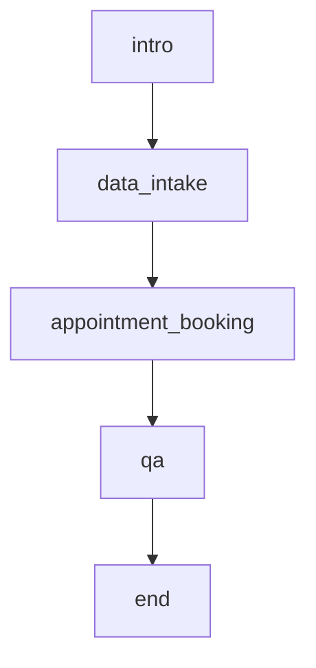

# Healthcare Intake & Scheduling

## Intro

This example scenario demonstrates how to run a full patient screening conversation that collects intake details, schedules an appointment, answers clinic questions, and then closes the session cleanly.

The avatar will act as a friendly medical screening assistant that guides the patient through the screening process, with access to a vision tool to view the patient's symptoms on camera if requested, as well as a RAG tool for clinic details and an appointment booking tool to schedule the appointment.

## Scenario Overview

The avatar's role instruction:

> "You are a friendly and professional medical screening assistant..."

The scenario is structured around the following node sequence:

- `intro`
  - "Greet the patient warmly and introduce yourself as a medical screening assistant..."
  - Uses `transition` tools.
- `data_intake`
  - "Collect the patient's basic information..."
  - Uses `transition`, `vision` tools.
- `appointment_booking`
  - "Help the patient schedule an appointment..."
  - Uses `http` tools.
- `qa`
  - "Answer the patient's questions about the screening process, our clinic, or anything else they want to know..."
  - Uses `transition`, `rag` tools.
- `end`
  - "Thank the patient for completing the screening..."
  - Ends the conversation after the assistant responds.

### Node Graph



## Secrets

Create these secrets in the [Akapulu secrets tab](https://akapulu.com/secrets) before testing the endpoints in this example:

- **Create secret `webhook_token`**

  - Name: `webhook_token`
  - Example value: `webhook_secret_123`


## Local Endpoint Server

Endpoints need to be hosted at public HTTP URLs that can receive incoming requests.

For this example, we use a lightweight local Flask server in `Flask Server/flask-server.py`.

Server file: `Flask Server/flask-server.py`

Endpoint name: `Patient Intake Get Availability`
- Route: `POST /get-availability`
- Local port: `8080`
- Handler description: `Returns a list of available appointment slots for the requested preferred date and appointment type.`
Endpoint name: `Patient Intake Book Appointment`
- Route: `POST /book-appointment`
- Local port: `8080`
- Handler description: `Accepts appointment booking details, logs request metadata, and returns a generated appointment confirmation id.`

Run the Flask server:

0) Clone the examples repo and move into this scenario folder.

```bash
git clone https://github.com/Akapulu/akapulu-examples.git && cd akapulu-examples/example-scenarios/healthcare-intake-scheduling
```

1) Create and activate a virtual environment, then install Flask.

```bash
python3 -m venv flask-venv && source flask-venv/bin/activate && pip install flask
```

2) Move into the server directory and start the local HTTP server.

```bash
cd "Flask Server" && python flask-server.py
```

## ngrok Setup

Your endpoints must be publicly reachable so Akapulu can call them during a live conversation. In production, you can host them on any platform you prefer.

For this demo, we use [ngrok](https://ngrok.com/docs/guides/share-localhost/quickstart) to create a public HTTPS URL that forwards to your local Flask server.

### 1) Create your ngrok account

- Sign up at [dashboard.ngrok.com/signup](https://dashboard.ngrok.com/signup).
- After signup, open your auth token page: [dashboard.ngrok.com/get-started/your-authtoken](https://dashboard.ngrok.com/get-started/your-authtoken).

### 2) Install ngrok and connect your account

Install ngrok (macOS):

```bash
brew install ngrok
```

Add your auth token:

```bash
ngrok config add-authtoken $YOUR_TOKEN
```

### 3) Copy your assigned public URL (free tier)

Note: ngrok provides one automatically assigned dev domain on free plans, which you can copy from the Domains page.

- Open [dashboard.ngrok.com/domains](https://dashboard.ngrok.com/domains).
- Copy your assigned dev domain URL (`https://<YOUR_NGROK_DOMAIN>`).

### 4) Start ngrok for your Flask server

Keep your Flask server running, then open a separate terminal window and run:

```bash
ngrok http 8080 --url https://<YOUR_NGROK_DOMAIN>
```

This starts an ngrok public endpoint and securely forwards incoming requests to your local Flask server on port `8080`.

Use that same ngrok domain in your Akapulu endpoint URL.

`https://<YOUR_NGROK_DOMAIN>/get-availability`

## Endpoints

This scenario uses 2 [HTTP endpoint](https://docs.akapulu.com/guides/endpoints/create-endpoint) configurations.

When configuring endpoint fields, we use Akapulu [templates and variable syntax](https://docs.akapulu.com/guides/endpoints/templates-and-variables) for runtime values and node context.

### Create the `Patient Intake Get Availability` endpoint

Create an endpoint that runs as the action for `get_availability`.

Use your ngrok public domain in the endpoint URL below.

Go to [akapulu.com/endpoints](https://akapulu.com/endpoints), click **Create Endpoint**, then enter:

- **Setup tab**

  - Name: `Patient Intake Get Availability`
  - URL: `https://<YOUR_NGROK_DOMAIN>/get-availability`
  - Method: `POST`

- **Headers/Body tab**

  - `headers`:

    ```json
    {
      "Content-Type": "application/json",
      "X-Patient-ID": "{{runtime.patient_id}}",
      "Authorization": "Bearer {{secret.webhook_token}}"
    }
    ```

  - `body`:

    ```json
    {
      "preferred_date": "{{llm.preferred_date:Preferred date or start of range in YYYY-MM-DD}}",
      "appointment_type": "{{llm.appointment_type:Type like follow_up or new_consult}}",
      "patient_id": "{{runtime.patient_id}}"
    }
    ```

### Create the `Patient Intake Book Appointment` endpoint

Create an endpoint that runs as the action for `book_appointment`.

Use your ngrok public domain in the endpoint URL below.

Go to [akapulu.com/endpoints](https://akapulu.com/endpoints), click **Create Endpoint**, then enter:

- **Setup tab**

  - Name: `Patient Intake Book Appointment`
  - URL: `https://<YOUR_NGROK_DOMAIN>/book-appointment`
  - Method: `POST`

- **Headers/Body tab**

  - `headers`:

    ```json
    {
      "Content-Type": "application/json",
      "X-Patient-ID": "{{runtime.patient_id}}",
      "Authorization": "Bearer {{secret.webhook_token}}"
    }
    ```

  - `body`:

    ```json
    {
      "date": "{{llm.date:Appointment date in YYYY-MM-DD}}",
      "time": "{{llm.time:Appointment time in HH:MM 24-hour}}",
      "appointment_type": "{{llm.appointment_type:Type like follow_up or new_consult}}",
      "patient_id": "{{runtime.patient_id}}",
      "source": "patient_intake_screening"
    }
    ```

## Knowledge Bases

This example uses an Akapulu [knowledge base](https://docs.akapulu.com/guides/knowledge-bases/overview) and a node-level [RAG tool](https://docs.akapulu.com/guides/scenarios/overview#create-the-rag-tool) so the assistant can answer questions from retrieved document context instead of guessing.

### Create the knowledge base `Healthcare Intake Demo Knowledge Base`

1) Go to [akapulu.com/knowledge-bases](https://akapulu.com/knowledge-bases) and click **Create**.

2) Enter knowledge base details:

- **Knowledge base details**

  - Name: `Healthcare Intake Demo Knowledge Base`
  - Description: `Reference information for the Healthcare Intake & Scheduling demo scenario, including clinic policies, appointment details, and patient-facing FAQ content.`

3) Open the knowledge base you created, then click **Add Document**.

4) Enter document details:

- **Document details**

  - Name: `Clinic Details`
  - Description: `Clinic operations, hours, policies, and scheduling information used by the demo assistant for patient Q&A.`

5) Upload this file:

  - `./Clinic-Details.md`

## IDs

Before creating the scenario, copy these IDs:

- Endpoint ID for `Patient Intake Get Availability`
- Endpoint ID for `Patient Intake Book Appointment`
- Knowledge base ID for `Healthcare Intake Demo Knowledge Base`
- (optionally) Avatar ID (UUID) for the avatar you want to use

## Scenario

1) Go to [akapulu.com/scenarios](https://akapulu.com/scenarios) and click **Create Scenario**.

2) Enter a name for your scenario.
For example: `Healthcare Intake & Scheduling Demo`

3) Click the **JSON** option in the nodes/json toggle.

### Paste this node configuration

For JSON structure, field rules, and schema details, see the [Using JSON guide](https://docs.akapulu.com/guides/scenarios/using-json).

Paste in the following JSON:

Replace every placeholder ID in this JSON with your actual IDs from the endpoints and knowledge bases you created.

```json
{
  "role_instruction": "You are a friendly and professional medical screening assistant.\n\nYour responses will be converted to audio, so keep them concise and avoid special characters.\n\nSpeak clearly and warmly to help patients feel comfortable.\n\nDo not start sentences with short bursts like sure! or absolutely! since short bursts lead to choppy audio.",
  "nodes": {
    "intro": {
      "functions": [
        {
          "name": "transition_to_data_intake",
          "type": "transition",
          "description": "Use this function to transition to the data_intake phase after they have given consent to proceed.",
          "transition_to": "data_intake"
        }
      ],
      "task_instruction": "Greet the patient warmly and introduce yourself as a medical screening assistant. Explain that you'll help them with a brief screening questionnaire.\n\nAfter they have given consent to move to next stage, use the transition tool to move forward to the data intake phase."
    },
    "data_intake": {
      "functions": [
        {
          "name": "transition_to_appointment_booking",
          "type": "transition",
          "description": "Transition to the appointment booking phase.",
          "transition_to": "appointment_booking"
        },
        {
          "name": "VIEW_CAMERA",
          "type": "vision",
          "description": "Use this tool when the user asks you to look at the screen"
        }
      ],
      "task_instruction": "Collect the patient's basic information. Ask for their full name, age, primary reason for visit, and any current symptoms or concerns. Be conversational and ask one question at a time.\n\nIf the patient indicates they are showing something on camera (for example: this part of my hand hurts, can you see this rash, what does this look like), call the vision tool.\n\nWhen you've gathered enough information, use the transition tool to move to appointment booking.\n\nIf the patient asks questions, politely redirect them to answer the screening questions first, and mention they can ask questions later in the Q&A phase."
    },
    "appointment_booking": {
      "functions": [
        {
          "name": "get_availability",
          "type": "http",
          "description": "Fetch available appointment slots before booking. Call this after the patient gives a preferred date and appointment type so you can offer real open slots.",
          "endpoint_id": "<YOUR_GET_AVAILABILITY_ENDPOINT_ID>"
        },
        {
          "name": "book_appointment",
          "type": "http",
          "description": "Call this tool to book the appointment after the patient has confirmed one of the available slots returned by get_availability.",
          "endpoint_id": "<YOUR_BOOK_APPOINTMENT_ENDPOINT_ID>",
          "transition_to": "qa"
        }
      ],
      "task_instruction": "Help the patient schedule an appointment. Ask about their preferred date and whether they prefer in-person or virtual consultation. \n\nOnce you have a preferred date and appointment type, call the get_availability tool to fetch real open slots and offer those to the patient.\n\nAfter the patient picks a slot, use the book_appointment tool to confirm the booking.\n\nNote - today is {{runtime.today}}"
    },
    "qa": {
      "functions": [
        {
          "name": "transition_to_end_screening",
          "type": "transition",
          "description": "Transition to the end of the screening session.",
          "transition_to": "end"
        },
        {
          "name": "about_our_clinic",
          "type": "rag",
          "knowledge_base_id": "<YOUR_ABOUT_OUR_CLINIC_KNOWLEDGE_BASE_ID>",
          "description": "a RAG tool with information about our clinic"
        }
      ],
      "task_instruction": "Answer the patient's questions about the screening process, our clinic, or anything else they want to know. Be helpful, empathetic, and professional. If you don't know something, suggest they discuss it with their doctor during the appointment. Keep responses concise since they'll be converted to audio.\n\nUse the transition tool to end the screening session when the patient is ready to conclude.\n\nIf they have a question about our clinic use the about_our_clinic rag tool"
    },
    "end": {
      "task_instruction": "Thank the patient for completing the screening. Provide a brief summary of next steps (e.g., 'We'll review your information and confirm your appointment details. A member of our team will contact you soon.').\n\nKeep it brief and friendly, then end the conversation.",
      "end_after_bot_response": true
    }
  },
  "initial_node": "intro"
}
```

After you paste the JSON, click **Save**. Use the toggle in the top-right corner of the scenario editor to switch between JSON mode and visual mode.

## Runtime Variables

This example expects the following runtime variables when you call the connect flow:

- `patient_id`
- `today`

```ts
{
  patient_id: "patient_001",
  today: new Date().toISOString().slice(0, 10),
};
```

## Use in UI

After your scenario is saved, [integrate it in your own application](https://docs.akapulu.com/guides/conversations/customize-conversation-ui) using the [Akapulu Web SDK](https://docs.akapulu.com/web-sdk/overview).

This repository also includes demo applications built with the Web SDK under:

```text
fundamentals/
  prebuilt-ui/
  custom-ui/
```

Related docs pages:

- [Prebuilt UI](https://docs.akapulu.com/examples/basic/prebuilt-ui)
- [Custom UI](https://docs.akapulu.com/examples/basic/custom-ui)

In the payload to the [`connectConversation`](https://docs.akapulu.com/web-sdk/server-sdk#connect-conversation) method, pass `scenario_id`, `avatar_id`, and runtime variables required by this scenario (`patient_id`, `today`), for example:

```ts
const runtimeVars = {
  patient_id: "patient_001",
  today: new Date().toISOString().slice(0, 10),
};

const patientName = "James Bradford";

const sttKeywords = [patientName];

const connectPayload = {
  // Replace with your scenario id
  scenario_id: "<scenario id here>",

  // Catalog avatar id
  avatar_id: "f77de1e5-6ce3-448c-8cff-a8cc3c8a50bf",

  // Patient name as speech recognition keyword
  stt_keywords: sttKeywords,

  // Runtime variables
  runtime_vars: runtimeVars,

  // Record conversation
  record_conversation: true,
};

return await akapulu.connectConversation(connectPayload);
```

For public avatar options, browse the [Avatar Catalog guide](https://docs.akapulu.com/guides/avatars/avatar-catalog).
